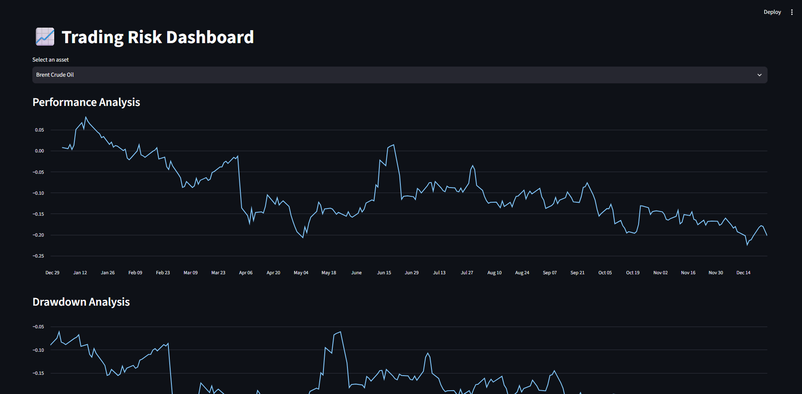

# 📈 Trading Risk Dashboard

Trading Risk Dashboard built with Python, Pandas and Streamlit.

## Présentation

Ce projet consiste à développer un tableau de bord d'analyse des marchés financiers permettant d'étudier la performance et le risque d'actifs financiers à partir de données historiques.

L'objectif est de construire un outil capable de transformer des données de marché brutes en indicateurs exploitables grâce à Python et aux bibliothèques d'analyse de données.

Le dashboard permet notamment d'analyser :

- Rendements historiques
- Performance cumulée
- Volatilité annualisée
- Sharpe Ratio
- Maximum Drawdown
- Distribution des rendements
- Visualisations interactives

Le projet s'inscrit dans une démarche d'apprentissage appliquée à la finance quantitative, avec une approche orientée Data Analysis : collecte des données, nettoyage, calcul d'indicateurs, visualisation et déploiement d'une application interactive avec Streamlit.


## Objectifs du projet

Les objectifs principaux sont :

- Manipuler des données financières avec Python et Pandas
- Automatiser le calcul d'indicateurs de risque
- Structurer un projet Python avec une séparation entre données, logique métier et interface
- Créer un dashboard interactif permettant d'explorer différents actifs financiers


## Actifs analysés

Le dashboard permet actuellement d'analyser :

- Nasdaq Composite (^IXIC)
- Gold Futures (GC=F)
- Brent Crude Oil Futures (BZ=F)

Les données historiques sont récupérées via Yahoo Finance.


## Architecture du projet

Le projet est organisé afin de séparer les différentes responsabilités :

```text
Trading-Risk-Dashboard/

│
├── dashboard/
│   └── app.py                  # Application Streamlit
│
├── src/
│   ├── data_loader.py          # Chargement des données financières
│   ├── risk_metrics.py         # Calcul des indicateurs de risque
│   └── visualization.py       # Fonctions de visualisation
│
├── notebooks/
│   ├── 01_market_analysis.ipynb
│   └── 02_multi_asset_analysis.ipynb
│
├── exercises/                  # Exercices Python appliqués à la finance
│   ├── ...
│
├── learning/                   # Notes et apprentissage Python
│   ├── ...
│
├── data/                       # Données utilisées
│
├── requirements.txt            # Dépendances Python
│
└── README.md
```
---

## Organisation du projet

Le projet a été construit progressivement.

Les dossiers `learning/` et `exercises/` retracent la phase d'apprentissage initiale, avec des exercices Python appliqués aux concepts financiers fondamentaux (rendements, volatilité, manipulation de données).

Les dossiers `src/` et `dashboard/` correspondent à la version finale de l'application, avec une séparation entre :
- la récupération des données ;
- le calcul des métriques financières ;
- la visualisation ;
- l'interface utilisateur.


Puis :

```markdown
## Technologies utilisées

- Python
- Pandas
- NumPy
- Streamlit
- Matplotlib
- Seaborn
- Yahoo Finance API (via yfinance)


### Exemple de visualisation




## Installation et utilisation

### 1. Cloner le repository

```bash
git clone https://github.com/amiralthrawn/Trading-Risk-Dashboard.git 
```

Puis se placer dans le dossier du projet :

```bash
cd Trading-Risk-Dashboard
```

### 2. Créer un environnement virtuel

Créer un environnement Python isolé :

```bash
python -m venv .venv
```

Activer l'environnement virtuel :

Sur Windows :

```bash
.venv\Scripts\activate
```

Sur macOS/Linux :

```bash
source .venv/bin/activate
```

### 3. Installer les dépendances

Installer les bibliothèques nécessaires :

```bash
pip install -r requirements.txt
```

### 4. Lancer le dashboard

Démarrer l'application Streamlit :

```bash
streamlit run dashboard/app.py
```

L'application sera ensuite accessible dans le navigateur à l'adresse indiquée par Streamlit.

## Future Improvements

Quelques pistes d'amélioration possibles :

- Ajouter davantage d'actifs financiers analysables
- Intégrer une base de données financière plus avancée
- Ajouter des indicateurs de risque supplémentaires
- Permettre une comparaison entre plusieurs actifs
- Déployer l'application sur une plateforme cloud
```